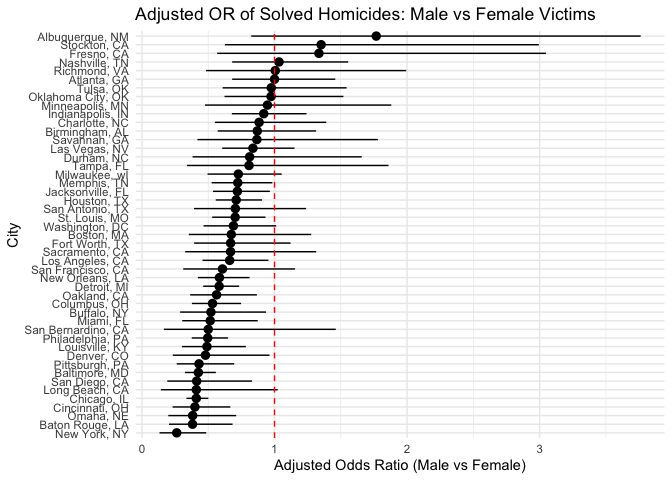
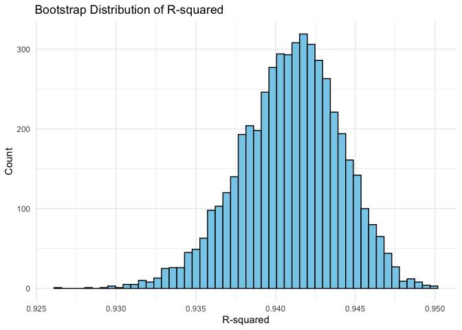
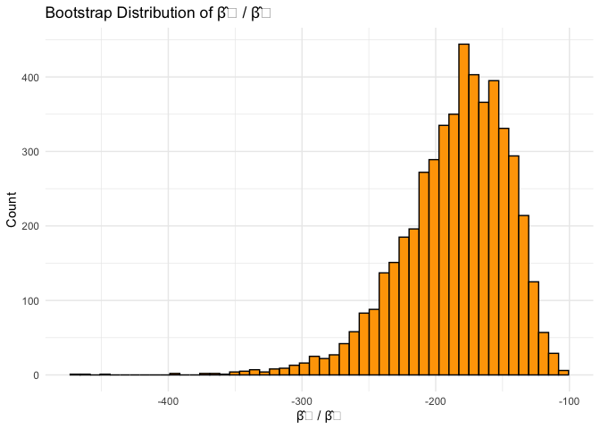
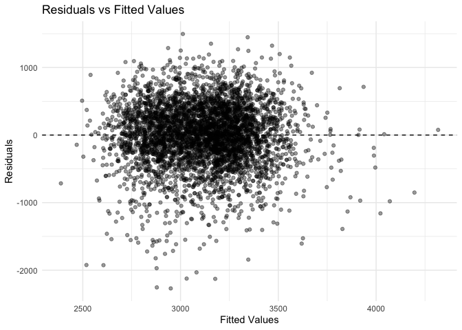
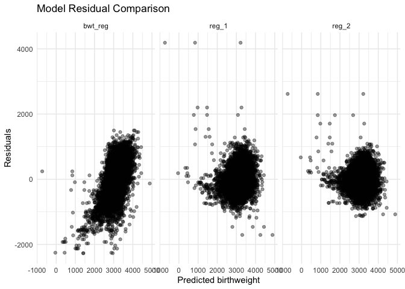
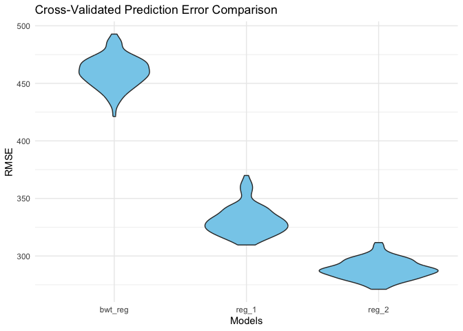

p8105_hw6_cc5424
================
ChuqiChen
2025-12-03

\#problem1

``` r
library(tidyverse)
```

    ## ── Attaching core tidyverse packages ──────────────────────── tidyverse 2.0.0 ──
    ## ✔ dplyr     1.1.4     ✔ readr     2.1.5
    ## ✔ forcats   1.0.0     ✔ stringr   1.5.1
    ## ✔ ggplot2   3.5.2     ✔ tibble    3.3.0
    ## ✔ lubridate 1.9.4     ✔ tidyr     1.3.1
    ## ✔ purrr     1.1.0     
    ## ── Conflicts ────────────────────────────────────────── tidyverse_conflicts() ──
    ## ✖ dplyr::filter() masks stats::filter()
    ## ✖ dplyr::lag()    masks stats::lag()
    ## ℹ Use the conflicted package (<http://conflicted.r-lib.org/>) to force all conflicts to become errors

``` r
library(broom)
library(ggplot2)

# 读入数据
homicides <- readr::read_csv("https://raw.githubusercontent.com/washingtonpost/data-homicides/master/homicide-data.csv")
```

    ## Rows: 52179 Columns: 12
    ## ── Column specification ────────────────────────────────────────────────────────
    ## Delimiter: ","
    ## chr (9): uid, victim_last, victim_first, victim_race, victim_age, victim_sex...
    ## dbl (3): reported_date, lat, lon
    ## 
    ## ℹ Use `spec()` to retrieve the full column specification for this data.
    ## ℹ Specify the column types or set `show_col_types = FALSE` to quiet this message.

``` r
# 创建 city_state
homicides <- homicides %>%
  mutate(city_state = paste(city, state, sep = ", "),
         victim_age = as.numeric(victim_age),
         solved = ifelse(disposition == "Closed by arrest", 1, 0))
```

    ## Warning: There was 1 warning in `mutate()`.
    ## ℹ In argument: `victim_age = as.numeric(victim_age)`.
    ## Caused by warning:
    ## ! NAs introduced by coercion

``` r
# 过滤掉指定城市 & 限制种族
clean_dat <- homicides %>%
  filter(!(city_state %in% c("Dallas, TX", "Phoenix, AZ", "Kansas City, MO", "Tulsa, AL"))) %>%
  filter(victim_race %in% c("White", "Black"))
```

``` r
balt <- clean_dat %>% filter(city_state == "Baltimore, MD")

fit_balt <- glm(
  solved ~ victim_age + victim_sex + victim_race,
  data = balt,
  family = binomial
)

tidy_balt <- broom::tidy(fit_balt, conf.int = TRUE, exponentiate = TRUE)
male_OR_balt <- tidy_balt %>% filter(term == "victim_sexMale")

male_OR_balt
```

    ## # A tibble: 1 × 7
    ##   term           estimate std.error statistic  p.value conf.low conf.high
    ##   <chr>             <dbl>     <dbl>     <dbl>    <dbl>    <dbl>     <dbl>
    ## 1 victim_sexMale    0.426     0.138     -6.18 6.26e-10    0.324     0.558

``` r
# 每个城市运行 glm
models_by_city <- clean_dat %>%
  nest(data = -city_state) %>%
  mutate(
    model = map(data, ~ glm(
      solved ~ victim_age + victim_sex + victim_race,
      data = .x,
      family = binomial
    )),
    tidy = map(model, ~ broom::tidy(.x, conf.int = TRUE, exponentiate = TRUE))
  ) %>%
  select(city_state, tidy) %>%
  unnest(tidy) %>%
  filter(term == "victim_sexMale") %>%
  arrange(estimate)
```

    ## Warning: There were 43 warnings in `mutate()`.
    ## The first warning was:
    ## ℹ In argument: `tidy = map(model, ~broom::tidy(.x, conf.int = TRUE,
    ##   exponentiate = TRUE))`.
    ## Caused by warning:
    ## ! glm.fit: fitted probabilities numerically 0 or 1 occurred
    ## ℹ Run `dplyr::last_dplyr_warnings()` to see the 42 remaining warnings.

``` r
ggplot(models_by_city, aes(
  x = reorder(city_state, estimate),
  y = estimate,
  ymin = conf.low,
  ymax = conf.high
)) +
  geom_pointrange() +
  coord_flip() +
  geom_hline(yintercept = 1, linetype = "dashed", color = "red") +
  labs(
    title = "Adjusted OR of Solved Homicides: Male vs Female Victims",
    x = "City",
    y = "Adjusted Odds Ratio (Male vs Female)"
  ) +
  theme_minimal()
```

<!-- -->
Overall Trends

In many cities, the adjusted OR is below 1, indicating: Cases involving
male victims are less likely to be solved than those involving female
victims in these cities (after adjusting for age and race).

Several cities show an OR significantly greater than 1 (e.g.,
Albuquerque, NM), suggesting: Cases involving male victims are more
likely to be solved.

Differences in Confidence Interval Width

Some cities exhibit very wide confidence intervals (particularly those
with smaller samples), indicating unstable estimates.

Larger cities (e.g., Los Angeles, Chicago) have narrower CIs, suggesting
more reliable estimates.

Baltimore’s Position

Baltimore, MD’s OR is significantly below 1 (approximately 0.7),
indicating: In Baltimore, cases involving male victims are harder to
solve, even after controlling for age and race.

Significant Cross-City Variation

ORs vary considerably across cities, indicating: Solving rates are
influenced by structural factors such as city resources, judicial
systems, and policing practices, not solely by victim characteristics.

\#problem2

``` r
library(p8105.datasets)

data("weather_df")
```

``` r
boot_sample <- function(df) {
  df_boot <- df %>% sample_frac(replace = TRUE)
  
  fit <- lm(tmax ~ tmin + prcp, data = df_boot)
  
  r2 <- glance(fit)$r.squared
  
  coefs <- tidy(fit)
  beta1 <- coefs %>% filter(term == "tmin") %>% pull(estimate)
  beta2 <- coefs %>% filter(term == "prcp") %>% pull(estimate)
  
  ratio <- beta1 / beta2
  
  tibble(r2 = r2, ratio = ratio)
}
```

``` r
set.seed(123)

boot_results <- 
  tibble(i = 1:5000) %>%
  mutate(est = map(i, ~ boot_sample(weather_df))) %>%
  unnest(est)
```

``` r
ggplot(boot_results, aes(x = r2)) +
  geom_histogram(bins = 50, fill = "skyblue", color = "black") +
  labs(
    title = "Bootstrap Distribution of R-squared",
    x = "R-squared",
    y = "Count"
  ) +
  theme_minimal()
```

<!-- -->

``` r
ggplot(boot_results, aes(x = ratio)) +
  geom_histogram(bins = 50, fill = "orange", color = "black") +
  labs(
    title = "Bootstrap Distribution of β̂₁ / β̂₂",
    x = "β̂₁ / β̂₂",
    y = "Count"
  ) +
  theme_minimal()
```

<!-- -->

``` r
boot_results %>% 
  summarize(
    r2_lower = quantile(r2, 0.025),
    r2_upper = quantile(r2, 0.975)
  )
```

    ## # A tibble: 1 × 2
    ##   r2_lower r2_upper
    ##      <dbl>    <dbl>
    ## 1    0.934    0.947

``` r
boot_results %>% 
  summarize(
    ratio_lower = quantile(ratio, 0.025, na.rm = TRUE),
    ratio_upper = quantile(ratio, 0.975, na.rm = TRUE)
  )
```

    ## # A tibble: 1 × 2
    ##   ratio_lower ratio_upper
    ##         <dbl>       <dbl>
    ## 1       -279.       -125.

The bootstrap distribution of R² is highly concentrated and
approximately normal, with a mean around 0.94 and a very narrow
distribution, indicating that the model fit remains highly stable during
resampling.

The bootstrap distribution of β₁/β₂ exhibits a more pronounced right
skew and longer tails, suggesting that this ratio is relatively
unstable, influenced by the small and highly variable prcp coefficient.

\#problem3

``` r
# Load packages
library(tidyverse)
library(modelr)
```

    ## 
    ## Attaching package: 'modelr'

    ## The following object is masked from 'package:broom':
    ## 
    ##     bootstrap

``` r
library(broom)
library(janitor)
```

    ## 
    ## Attaching package: 'janitor'

    ## The following objects are masked from 'package:stats':
    ## 
    ##     chisq.test, fisher.test

``` r
# Load and clean the data
birthweight =
  read_csv("./data/birthweight.csv") %>% 
  janitor::clean_names() %>% 
  mutate(
    babysex = factor(babysex, levels = c(1,2), labels = c("male","female")),
    frace   = factor(frace, levels = c(1,2,3,4,8,9),
                     labels = c("White","Black","Asian","Puerto Rican","Other","Unknown")),
    malform = factor(malform, levels = c(0,1), labels = c("absent","present")),
    mrace   = factor(mrace, levels = c(1,2,3,4,8),
                     labels = c("White","Black","Asian","Puerto Rican","Other"))
  )
```

    ## Rows: 4342 Columns: 20

    ## ── Column specification ────────────────────────────────────────────────────────
    ## Delimiter: ","
    ## dbl (20): babysex, bhead, blength, bwt, delwt, fincome, frace, gaweeks, malf...
    ## 
    ## ℹ Use `spec()` to retrieve the full column specification for this data.
    ## ℹ Specify the column types or set `show_col_types = FALSE` to quiet this message.

``` r
# Check missing data
sum(is.na(birthweight))
```

    ## [1] 0

``` r
# Main model (biology + parental characteristics)
# NOTE: delwt = ppwt + wtgain  → wtgain is dropped due to collinearity
bwt_reg =
  lm(bwt ~ delwt + frace + mheight + momage + mrace + ppwt + wtgain,
     data = birthweight)

summary(bwt_reg)
```

    ## 
    ## Call:
    ## lm(formula = bwt ~ delwt + frace + mheight + momage + mrace + 
    ##     ppwt + wtgain, data = birthweight)
    ## 
    ## Residuals:
    ##      Min       1Q   Median       3Q      Max 
    ## -2269.79  -251.83    20.47   301.40  1496.21 
    ## 
    ## Coefficients: (1 not defined because of singularities)
    ##                    Estimate Std. Error t value Pr(>|t|)    
    ## (Intercept)       1346.5191   179.0141   7.522 6.53e-14 ***
    ## delwt               11.9621     0.6445  18.559  < 2e-16 ***
    ## fraceBlack        -147.8360    77.6479  -1.904   0.0570 .  
    ## fraceAsian         -45.3700   116.7547  -0.389   0.6976    
    ## fracePuerto Rican  -74.2828    75.1570  -0.988   0.3230    
    ## fraceOther         -32.9504   124.7444  -0.264   0.7917    
    ## mheight             16.3030     2.9925   5.448 5.38e-08 ***
    ## momage               3.8294     1.9678   1.946   0.0517 .  
    ## mraceBlack        -150.5289    77.5295  -1.942   0.0523 .  
    ## mraceAsian          25.0255   121.1314   0.207   0.8363    
    ## mracePuerto Rican  -37.4718    76.0116  -0.493   0.6221    
    ## ppwt                -7.6800     0.7211 -10.651  < 2e-16 ***
    ## wtgain                   NA         NA      NA       NA    
    ## ---
    ## Signif. codes:  0 '***' 0.001 '**' 0.01 '*' 0.05 '.' 0.1 ' ' 1
    ## 
    ## Residual standard error: 459.4 on 4330 degrees of freedom
    ## Multiple R-squared:  0.1973, Adjusted R-squared:  0.1952 
    ## F-statistic: 96.74 on 11 and 4330 DF,  p-value: < 2.2e-16

``` r
broom::glance(bwt_reg)
```

    ## # A tibble: 1 × 12
    ##   r.squared adj.r.squared sigma statistic   p.value    df  logLik    AIC    BIC
    ##       <dbl>         <dbl> <dbl>     <dbl>     <dbl> <dbl>   <dbl>  <dbl>  <dbl>
    ## 1     0.197         0.195  459.      96.7 3.28e-197    11 -32772. 65569. 65652.
    ## # ℹ 3 more variables: deviance <dbl>, df.residual <int>, nobs <int>

``` r
broom::tidy(bwt_reg)
```

    ## # A tibble: 13 × 5
    ##    term              estimate std.error statistic   p.value
    ##    <chr>                <dbl>     <dbl>     <dbl>     <dbl>
    ##  1 (Intercept)        1347.     179.        7.52   6.53e-14
    ##  2 delwt                12.0      0.645    18.6    4.78e-74
    ##  3 fraceBlack         -148.      77.6      -1.90   5.70e- 2
    ##  4 fraceAsian          -45.4    117.       -0.389  6.98e- 1
    ##  5 fracePuerto Rican   -74.3     75.2      -0.988  3.23e- 1
    ##  6 fraceOther          -33.0    125.       -0.264  7.92e- 1
    ##  7 mheight              16.3      2.99      5.45   5.38e- 8
    ##  8 momage                3.83     1.97      1.95   5.17e- 2
    ##  9 mraceBlack         -151.      77.5      -1.94   5.23e- 2
    ## 10 mraceAsian           25.0    121.        0.207  8.36e- 1
    ## 11 mracePuerto Rican   -37.5     76.0      -0.493  6.22e- 1
    ## 12 ppwt                 -7.68     0.721   -10.7    3.62e-26
    ## 13 wtgain               NA       NA        NA     NA

``` r
# Residuals vs Fitted Plot
birthweight %>% 
  add_predictions(bwt_reg) %>% 
  add_residuals(bwt_reg) %>% 
  ggplot(aes(x = pred, y = resid)) +
  geom_point(alpha = 0.4) +
  geom_hline(yintercept = 0, linetype = "dashed") +
  labs(
    title = "Residuals vs Fitted Values",
    x = "Fitted Values",
    y = "Residuals"
  ) +
  theme_minimal()
```

<!-- -->

``` r
# Comparison models

# Model 1: blength + gaweeks (main effects only)
reg_1 =
  lm(bwt ~ blength + gaweeks, data = birthweight)

# Model 2: Three-way interaction among bhead * blength * babysex
reg_2 =
  lm(bwt ~ bhead * blength * babysex, data = birthweight)

# Compare model residuals visually
birthweight %>% 
  gather_predictions(bwt_reg, reg_1, reg_2) %>% 
  gather_residuals(bwt_reg, reg_1, reg_2) %>% 
  ggplot(aes(x = pred, y = resid)) +
  geom_point(alpha = 0.4) +
  facet_grid(~ model) +
  labs(
    title = "Model Residual Comparison",
    x = "Predicted birthweight",
    y = "Residuals"
  ) +
  theme_minimal()
```

<!-- -->

``` r
# Monte Carlo Cross-Validation (100 splits)
set.seed(123)

cv_df =
  crossv_mc(birthweight, 100) %>% 
  mutate(
    train = map(train, as_tibble),
    test  = map(test, as_tibble)
  ) %>% 
  mutate(
    # Fit all 3 models
    bwt_reg = map(train,
                  \(df) lm(bwt ~ delwt + frace + mheight + momage + mrace + ppwt + wtgain,
                          data = df)),
    reg_1   = map(train,
                  \(df) lm(bwt ~ blength + gaweeks, data = df)),
    reg_2   = map(train,
                  \(df) lm(bwt ~ bhead * blength * babysex, data = df))
  ) %>% 
  mutate(
    # Compute RMSE for each
    rmse_bwt_reg = map2_dbl(bwt_reg, test, \(mod, df) rmse(model = mod, data = df)),
    rmse_reg_1   = map2_dbl(reg_1,   test, \(mod, df) rmse(model = mod, data = df)),
    rmse_reg_2   = map2_dbl(reg_2,   test, \(mod, df) rmse(model = mod, data = df))
  ) %>% 
  select(starts_with("rmse")) %>% 
  pivot_longer(
    everything(),
    names_to = "model",
    values_to = "rmse",
    names_prefix = "rmse_"
  ) %>% 
  mutate(model = fct_inorder(model))

# Cross-validation RMSE comparison plot
cv_plot =
  cv_df %>% 
  ggplot(aes(x = model, y = rmse)) +
  geom_violin(fill = "skyblue") +
  labs(
    title = "Cross-Validated Prediction Error Comparison",
    x = "Models",
    y = "RMSE"
  ) +
  theme_minimal()

cv_plot
```

<!-- -->
